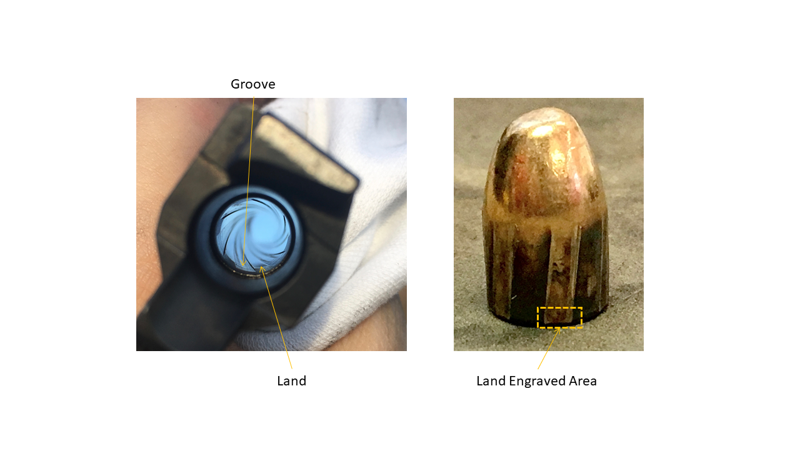
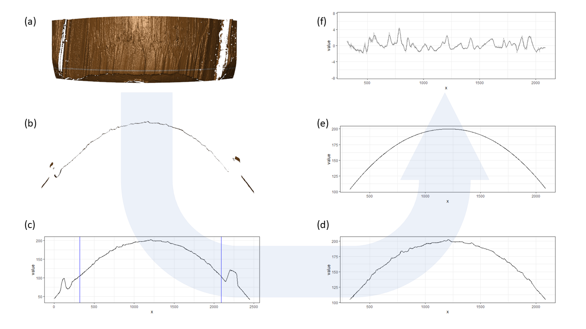
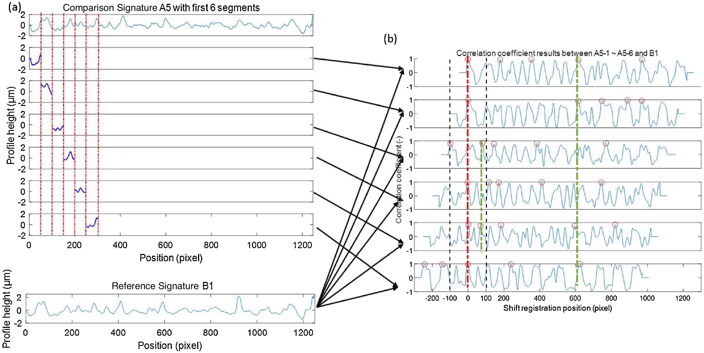

background-image: url("images/title-slide-bkgd.png")


<br> </br>

## Reproducibility and Statistical Software Development

### Oral Preliminary Exam

#### Wangqian (Will) Ju

#### Iowa State University: Center for Statistics and Applications in Forensic Evidence

#### 2023-10-10

```{r, load_refs, include=FALSE, cache=FALSE}
library(RefManageR)
# remotes::install_github("ROpenSci/bibtex")
RefManageR::BibOptions(check.entries = FALSE,
                       bib.style = "authoryear",
                       cite.style = "alphabetic",
                       style = "markdown",
                       max.names = 1,
                       no.print.fields = c("urldate","file","issn","url","keywords","language","abstract"),
                       hyperlink = FALSE,
                       dashed = FALSE)
myBib <- RefManageR::ReadBib("ref.bib", check = FALSE)
```

```{r setup, include=FALSE}
library(tidyverse)
library(cmpsR)
library(x3ptools)
library(patchwork)
library(bulletxtrctr)
library(ggpubr)

options(htmltools.dir.version = FALSE)

knitr::opts_chunk$set(echo = TRUE,
                      fig.align = 'center',
                      cache=TRUE,
                      collapse = TRUE,
                      comment = "#>",
                      out.width = "\\textwidth",
                      dpi = 1000)
```

---

## About Me

- Undergraduate at University of California - Davis, CA, 2015-2019

  - B.Sc. in Statistics and Minor in Computer Science
  
- Graduate at Iowa State University, 2019-present

  - Summer 2021: received M.Sc. in Statistics
  - Summer 2021: passed the written preliminary exam
  
- Machine Learning Intern at Adobe

  - Summer 2022
  - Summer 2023
  
- Future: Hope to work as a Data Scientist or Machine Learning Engineer 

---

# Outline

- **Introduction** Reproducibility

- **Paper \#1** An Open-Source Implementation of the CMPS Algorithm for Assessing Similarity of Bullets

- **Paper \#2** One Model that Fits Them All: Psychometrics with Generalized Linear Mixed Effects Models

- **Paper \#3** `ggpaintr`: Building Modularized Shiny Apps for Reactive Plotting

- **Conclusions**

---

class: center, middle

# Introduction

## Reproducibility: What, Why, How

---

## Reproducibility: What

-   The concept of **reproducibility** is actually not clearly defined `r Citep(myBib, c("Gundersen2021", "Peng2011", "RRS2019", "nistNISTGuidelines", "acmArtifactReview", "Samuel2021", "Zilberman2020"))`
  
  -   The National Academies of Sciences, Engineering, and Medicine `r Citep(myBib, "RRS2019")`: 
  > "**Reproducibility** means computational reproducibility - obtaining consistent computational results using the same input data, computational steps, methods, code, and conditions of analysis. "
  
  -   Artifact Review and Badging `r Citep(myBib, "acmArtifactReview")`: 
  > "**Reproducibility** - The measurement can be obtained with stated precision by a different team using the same measurement procedure, the same measuring system, under the same operating conditions, in the same or a different location on multiple trials."
  
  -   `r Citep(myBib, "Peng2011")`:
  > A published data analysis is reproducible if the analytic data sets and the computer code used to create the data analysis are made available to others for independent study and analysis

---

## Reproducibility: Why

-   Reproducibility is important to the community

  -   "an attainable minimum standard for assessing the value of scientific claims" `r Citep(myBib, "Peng2011")`
  
  -   "an experimental result is not fully established unless it can be independently reproduced." `r Citep(myBib, "acmArtifactReview")`
  
  -   "a strong connection between openness and transparency and more reliable and trusted science" `r Citep(myBib, "RRS2019")`
  
  -   "validate experimental results, promote integrity of research, and accelerate follow up work" `r Citep(myBib, "Zilberman2020")`

-   Reproducible research is important to those who do it `r Citep(myBib, "Alston2021")`

  -   A by-product of careful attention to detail throught the research process
  
  -   Allows researchers to ensure that they can repeat the same analysis multiple times with the same results, at any point in that process


---

## Reproducibility: How

-   Efforts from researchers

  -   `r Citep(myBib, "RRS2019")`: "To help ensure the reproducibility of computational results, researchers should convey clear, specific, and complete information about data, code, models, and computational methods and analysis that support their published results."
  
  -   "A three-step framework for conducting reproducible research" `r Citep(myBib, "Alston2021")`
  
  -   Using tools that facilitate reproducible research `r Citep(myBib, c("Lasser2020", "Schwab2000"))`
  
-   Efforts from funding agencies and organizations

  -   "consider investing in research and development of opensource, usable tools and infrastructure that support reproducibility for a broad range of studies across different domains in a seamless fashion" `r Citep(myBib, "RRS2019")`
  
-   Efforts from journals and conferences


---

## Reproducibility: Challenges

-   The Reproducibility Crisis: researchers find difficulty in reproducing published results `r Citep(myBib, c("Samuel2021", "Raghupathi2022", "Xiong2022", "Samota2021"))`

-   Technological change / dependency hell `r Citep(myBib, c("Zheng2021", "Boettiger2015", "xie2014implementing", "Alston2021"))`
  
  -   Operational systems, hardware, and software are continuously changing
  
-   Complexity
  
  -   Knowledge about the field and the tools required to reproduce the results
  
-   Human error

-   Intellectual property rights

-   Challenges introduced by the review process

  -   Providing data, code, and instructions might break review anonymity `r Citep(myBib, c("Bajpai2017"))`


---

## Reproducibility and Statistical Software Development

1. **Reproduced results qualitatively**: An Open-Source Implementation of the CMPS Algorithm for Assessing Similarity of Bullets

2. **Reproduced results quantitatively and obtained new findings through re-analysis**: One Model that Fits Them All: Psychometrics with Generalized Linear Mixed Effects Models

3. **Tools that can facilitate reproducible research**: `ggpaintr`: Building Modularized Shiny Apps for Reactive Plotting

---

class: center, middle

## An Open-Source Implementation of the CMPS Algorithm for Assessing Similarity of Bullets

#### Ju & Hofmann, "The R Journal: An Open-Source Implementation of the CMPS Algorithm for Assessing Similarity of Bullets", The R Journal, 2022

---

## Motivation

- An attempt to reproduce the work of `r Citep(myBib, c("cmps"))`

- The Congruent Matching Profile Segments (CMPS) algorithm developed by National Institute of Standards and Technology (NIST) for objective comparison of striated tool marks

- The description of the algorithm is provided in the paper

- Code and data are not available

---

## Background

**Firearm Examination - Comparison of bullets**

-   Land-engraved striation marks

-   Visual comparison: comparison microscope, professional skills

-   Bullet signatures
.img100[]

---

## Background

**Bullet signature**

-   Hare et al. (2017) `r Citep(myBib, "aoas")`

-   3D topographical images, x3p

-   Shiny app: `bulletInspectR`
.img75[]

---

## Background

**Bullet signature**

-   crosscut, grooves, and profile of land engravings -- (a, b, c, d)

-   non-parametric LOESS smooth for the curvature to be removed `r Citep(myBib, "loess")` -- (e)

-   bullet signature -- (f)
.img75[]

---

## Background

**Examples of bullet signature**
-   two bullets fired from the same Ruger p-85 pistal barrel

-   known match comparison

```{r, echo=FALSE, fig.height=3}
library(cmpsR)
data(bullets)

signatures <- bullets %>% unnest(sigs)
signatures <- signatures %>% mutate(
  bulletland = factor(bulletland, levels=c(paste(rep(c(1,2), each=6), c(1:6,2:6,1), sep="-")))
)
plot.sig <- signatures %>% ggplot(aes(x = x/1000, y = sig)) + geom_line() + facet_wrap(~bulletland, ncol=6) +
  theme_bw() +
  xlab("Length in mm") +
  ylab("Relative height in micron")
plot.sig
```

---

## CMPS algorithm

-   Congruent Matching Profile Segments (CMPS) algorithm `r Citep(myBib, c("cmps"))`

-   Objective comparison of striated tool marks (bullet signatures in our case)

-   CMPS score (a similarity score)

---

## CMPS algorithm

CMPS scores
-   bullet 1 - land 2 (1-2) vs bullet 2 - land 3 (2-3): 17
-   bullet 1 - land 2 (1-2) vs bullet 2 - land 4 (2-4): 1

```{r, echo=FALSE, fig.height=3}
plot.sig
```

---

## CMPS algorithm

-   Comparison signature:
  -   Divided into consecutive and non-overlapping basis segments
-   Reference signature:
  -   Generate cross-correlation curves with basis segments

.img100[]

.footer[plot cited from Chen et al. 2019]

---
 
## CMPS algorithm

-   Congruent registration position
  -   Based on cross-correlation values
  -   Identified as the "best" registration position by the majority of basis segments (position 0 in the plot)

.img100[]

.footer[plot cited from Chen et al. 2019]


---
 
## CMPS algorithm
  
-   Congruent matching profile segments
  -   Basis segments taking the congruent registration position
  -   There are 5 congruent matching profile segments in this plot
  -   Final CMPS score: total number of congruent matching profile segments

.img100[]

.footer[plot cited from Chen et al. 2019]

---
 
## CMPS algorithm

To make the CMPS algorithm more effective:

-   Multi-peak inspection:

  -   Each cross-correlation curve will contribute multiple peak positions

-   Multi-segment lengths strategy

  -   Both basis segments and their enlarged version will be used for calculating the cross-correlation curves

-   Different parameter settings in the algorithm


---
 
## Implementation

**cmpsR**

-   R package
```{r tidy=FALSE, eval=FALSE}
install.packages("cmpsR")
```

-   development version available on GitHub:  
```{r tidy=FALSE, eval=FALSE}
# install.packages("devtools")
devtools::install_github("willju-wangqian/CMPS")
```

- The website of the package: [https://willju-wangqian.github.io/CMPS/](https://willju-wangqian.github.io/CMPS/)

---
 
## Implementation

The main function:

```{r, eval=FALSE}
extract_feature_cmps(
  x,
  y,
  seg_length = 50,
  Tx = 25,
   npeaks_set = c(5, 3, 1),
  include = NULL,
  outlength = NULL
)
```

-   `x` and `y` are the comparison signature and reference signature, respectively

-   `seg_length` specifies the length of a basis segment

-   ` npeaks_set` controls whether or not to use multi-segment lengths strategy

---
 
## Implementation - Examples

```{r, eval=FALSE}
library(CMPS)
data(bullets)
```

```{r, echo=FALSE, fig.height=3}
plot.sig
```

-   Known match (KM) comparison: `1-2` vs `2-3`
-   Known non match (KNM) comparison: `1-2` vs `2-4`

---
 
## Implementation - Examples 

**Example 1**

```{r, eval=TRUE}
library(cmpsR)
data(bullets)

sig1 <- bullets$sigs[bullets$bulletland == "1-2"][[1]]$sig
sig2 <- bullets$sigs[bullets$bulletland == "2-3"][[1]]$sig
sig3 <- bullets$sigs[bullets$bulletland == "2-4"][[1]]$sig

cmps.result.KM <- extract_feature_cmps(sig1, sig2)
cmps.result.KNM <- extract_feature_cmps(sig1, sig3)
```

-   Result of a known-match (KM) comparison:
```{r}
cmps.result.KM # 1-2 vs 2-3
```

-   Result of a known-non-match (KNM) comparison:
```{r}
cmps.result.KNM # 1-2 vs 2-4
```

---
 
## Implementation - Examples

**Example 2**

```{r, eval=TRUE}
cmps_without_multi_scale <- 
  extract_feature_cmps(sig1, sig2, 
                       npeaks_set = 5, include = "full_result")

cmps_with_multi_scale <- 
  extract_feature_cmps(sig1, sig2, 
                       npeaks_set = c(5,3,1), include = "full_result")
```

-   multi-peak inspection:
```{r}
cmps_without_multi_scale$CMPS_score
```

-   multi-peak inspection with multi-segment lengths strategy:
```{r}
cmps_with_multi_scale$CMPS_score
```


---
 
## Implementation

Full comparison of the two bullets in `CMPS::bullets`

```{r, echo=FALSE}
lands <- unique(bullets$bulletland)

comparisons <- data.frame(expand.grid(land1 = lands[1:6], land2 = lands[7:12]), 
                          stringsAsFactors = FALSE)

comparisons <- comparisons %>% 
  left_join(bullets %>% select(bulletland, sig1=sigs),
            by = c("land1" = "bulletland")) %>%
  left_join(bullets %>% select(bulletland, sig2=sigs),
            by = c("land2" = "bulletland"))

comparisons <- comparisons %>% mutate(
  cmps = purrr::map2(sig1, sig2, .f = function(x, y) {
    extract_feature_cmps(x$sig, y$sig, include = "full")
    })
)

comparisons <- comparisons %>% 
  mutate(
    cmps_score = sapply(comparisons$cmps, function(x) x$CMPS_score),
    cmps_nseg = sapply(comparisons$cmps, function(x) x$nseg)
  )

comparisons <- comparisons %>%
  mutate(
    bulletA = gsub("(\\d)-\\d", "\\1", land1),
    landA = gsub("\\d-(\\d)", "\\1", land1),
    bulletB = gsub("(\\d)-\\d", "\\1", land2),
    landB = gsub("\\d-(\\d)", "\\1", land2)
  )

dframe <- comparisons %>% select(-sig1, -sig2)

dframe$samesource <- with(dframe, bullet_to_land_predict(land1=landA, land2=landB, cmps_score, difference=1))
```

```{r, echo=FALSE}
# dframe %>% mutate(
#   land1 = as.numeric(landA),
#   land2 = as.numeric(landB)
# ) %>% with(., { 
#   cmpsR::compute_score_metrics(land1, land2, cmps_score)})
```


```{r, echo=FALSE, fig.height=3}
dframe <- dframe %>% mutate(
  landA = paste0("L", landA),
  landB = paste0("L", landB),
  landB = factor(landB, levels = paste0("L", c(2:6,1))),
  bulletA = paste0("Bullet ", bulletA),
  bulletB = paste0("Bullet ", bulletB)
)

full.comp <- dframe %>% ggplot(aes(x = landA, y = landB, fill = cmps_score)) + 
  geom_tile() + 
  geom_tile(aes(colour="same land"), fill=NA, data = dframe %>% filter(samesource), linewidth=1) + 
  scale_fill_gradient2("CMPS score", low = "gray80", high = "darkorange", midpoint = 6) + 
  scale_colour_manual("Source", values="darkorange") +
  facet_grid(bulletB ~ bulletA) + xlab("Bullet1 Lands") + 
  ylab("Bullet2 Lands") + 
  geom_text(aes(label=cmps_score)) +
  theme_bw() +
  theme(aspect.ratio = 1)
full.comp
```

-   each bullet has 6 land engravings, providing 6 bullet signatures
-   36 pairwise land-by-land comparisons in total

---
 
## Metrics 

-   Chen et al. proposed two metrics for bullet-level comparison based on CMPS scores `r Citep(myBib, "cmps")`
  -   $\mathrm{CMPS_{max}}$, $\mathrm{\overline{CMPS}_{max}}$

-   Another metric
  -   $\mathrm{\overline{CMPS}_{diff}}$

<!-- --- -->
<!--   -->
<!-- ## Metrics  -->

<!-- $\mathrm{CMPS_{max}}$ -->
<!-- -   the highest CMPS score obtained among all pairwise bullet signature comparisons -->

<!-- In general, we assume each bullet has $n$ land engravings (in our case $n=6$). Let $c_{ij}$ denote the CMPS score of a comparison between bullet 1 land $i$ and bullet 2 land $j$, for $i,j = 1, \dots, n$.  -->

<!-- $$\mathrm{CMPS_{max}} = \max_{i,j} c_{ij}$$ -->

---
 
## Metrics 

In general, we assume each bullet has $n$ land engravings (in our case $n=6$). Let $c_{ij}$ denote the CMPS score of a comparison between bullet 1 land $i$ and bullet 2 land $j$, for $i,j = 1, \dots, n$. 


-   $\mathrm{CMPS_{max}}$: the highest CMPS score obtained among all pairwise bullet signature comparisons

-   $\mathrm{CMPS_{max}} = \max_{i,j} c_{ij}$

---

## Metrics

Let $P_k$ denote bullet land pairs in phase $k$ for $k = 0, \dots, n-1$, and $P_k = \{ (i,j): i = 1, \dots, n ; j = (i + k) - n \cdot \unicode{x1D7D9}_{i + k > n} \}$, where $\unicode{x1D7D9}_A$ denotes an indicator function. For example, $P_1 = \{ (1,2), (2,3), (3,4), (4,5), (5,6), (6,1) \}$ when $n = 6$.


-   $\mathrm{\overline{CMPS}_{max}}$: the highest possible mean CMPS score of signature comparisons that are in the same phase

-   $\mathrm{\overline{CMPS}_{max}} = \max_{k} \left[  \frac{1}{n} \sum_{(i,j) \in P_k} c_{ij}\right]$

---
 
## Metrics 

Let $k^*$ denote the phase that results in $\mathrm{\overline{CMPS}_{max}}$

-   $\mathrm{\overline{CMPS}_{diff}}$: the difference between $\mathrm{\overline{CMPS}_{max}}$ and the mean of all other CMPS scores

-   $\mathrm{\overline{CMPS}_{diff}} = \left[  \frac{1}{n} \sum_{(i,j) \in P_{k^*}} c_{ij}\right] - \left[  \frac{1}{n(n-1)} \sum_{(i,j) \notin P_{k^*}} c_{ij}\right]$


---
 
## Metrics 

.pull-left[
The CMPS scores of all 36 pairwise bullet signatures comparisons

```{r, echo=FALSE, fig.height=6}
full.comp
```
].pull-right[
Calculation of different CMPS score metrics

.small[
$$\mathrm{CMPS_{max}} =  \max_{i,j} c_{ij} = 17$$

$$\mathrm{\overline{CMPS}_{max}} = \frac{1}{6} \sum_{(i,j) \in P_1} c_{ij} = 12.5$$

$$\mathrm{\overline{CMPS}_{diff}} = \frac{1}{6} \sum_{(i,j) \in P_1} c_{ij} - \frac{1}{30} \sum_{(i,j) \notin P_1} c_{ij} = 10.97$$
]
]  

- one score for bullet level similarity


---
 
## Results

Hamby set 252: 
-   The James Hamby Consecutively Rifled Ruger Barrel Study `r Citep(myBib, c("brundage", "hamby", "Hamby:2019"))`
-   35 bullets, ten consecutively manufactured Ruger P-85 pistol barrels
-   595 bullet level comparisons: 46 KM comparisons; 549 KNM comparisons

```{r, echo=FALSE}
presentation_plot_helper <- function(CMPS_hamby252_results_npeak, com.title252, break.list, seg_length.idx = 3, SSratio_value = FALSE ){
  labels <- expression( CMPS[max], bar(CMPS)[diff], {bar(CMPS)^symbol("*")}[diff], bar(CMPS)[max])
  
  p1 <- metric_plot_helper(CMPS_hamby252_results_npeak$cmps.table[[seg_length.idx]], "cmps.max", SSratio = SSratio_value, 
                           breaks = break.list[[1]]) +
    xlab(labels[1])
  p2 <- metric_plot_helper(CMPS_hamby252_results_npeak$cmps.table[[seg_length.idx]], "cmps.maxbar", SSratio = SSratio_value,
                           breaks = break.list[[2]]) +
    xlab(labels[4])
  p3 <- metric_plot_helper(CMPS_hamby252_results_npeak$cmps.table[[seg_length.idx]], "cmps.diff", SSratio = SSratio_value,
                           breaks = break.list[[3]]) +
    xlab(labels[2])
  
  p.result1_252 <- ggarrange(plotlist = list(p1, p2, p3), nrow = 1, ncol = 3,
                 common.legend = TRUE, legend = "bottom")
  p.result1_252 <- annotate_figure(p.result1_252, top = text_grob(com.title252))
  
  return(p.result1_252)
}
```

```{r hamby252, echo=FALSE, eval=TRUE, warning=FALSE}
all_results_container <- readRDS("data/CMPSpaper_results.rds")

CMPS_hamby252_results_npeak <- all_results_container$h252_npeak

# labels <- expression( CMPS[max], bar(CMPS)[diff], {bar(CMPS)^symbol("*")}[diff], bar(CMPS)[max])

com.title252 <- expression(
  atop(
    paste(
      "Hamby 252 - Distribution of ", CMPS[max], ", ", bar(CMPS)[max], " and ", bar(CMPS)[diff]
    ), 
    scriptstyle(" npeaks_set = 5, seg_length = 50")
  )
)

break.list2 <- list(
  seq(2, 24, 2), 
  seq(0, 20, 2),
  seq(0, 16, 2)
)

p.result1_252 <- 
  presentation_plot_helper(
    CMPS_hamby252_results_npeak, com.title252, break.list2, 
    seg_length.idx = 1, SSratio_value = FALSE
  )

p.result2_252 <- 
  presentation_plot_helper(
    CMPS_hamby252_results_npeak, com.title252, break.list2, 
    seg_length.idx = 1, SSratio_value = TRUE
  )
```


```{r, echo=FALSE}
com.title252_2 <- expression(
  atop(
    paste(
      "Hamby 252 - Distribution of ", CMPS[max], ", ", bar(CMPS)[max], " and ", bar(CMPS)[diff]
    ), 
    scriptstyle(" npeaks_set = c(5, 3, 1), seg_length = 50")
  )
)

break.list <- list(
  seq(2, 24, 2), 
  seq(0, 16, 2),
  seq(0, 16, 2)
)

p.result3_252 <- 
  presentation_plot_helper(
    CMPS_hamby252_results_npeak, com.title252_2, break.list, 
    seg_length.idx = 3, SSratio_value = FALSE
    )

p.result4_252 <- 
  presentation_plot_helper(
    CMPS_hamby252_results_npeak, com.title252_2, break.list, 
    seg_length.idx = 3, SSratio_value = TRUE
    )
```


---
 
## Results

Hamby set 252: 
-   parameter setting: multi-peak inspection
-   ` npeaks_set = 5`

```{r, echo=FALSE, fig.height=3.5}
p.result1_252
```

---
 
## Results

Hamby set 252: 
-   parameter setting: multi-peak inspection with multi-segment lengths
-   ` npeaks_set = c(5, 3, 1)`

```{r, echo=FALSE, fig.height=3.5}
p.result3_252
```

---
 
## Evaluation

Sum of squares ratio

$$V = \frac{\sum_k n_k (\bar{y}_{k.} - \bar{y}_{..})^2}{\sum_k \sum_l^{n_k} (y_{kl} - \bar{y}_{k.})^2 }$$

-   $k=2$, $n_1 = 46$, $n_2 = 549$
-   $y_{kl}$ - CMPS metric score
-   quantifies the separation between the KM group and the KNM group

---
 
## Evaluation

-   parameter setting: multi-peak inspection
-   ` npeaks_set = 5`

```{r, echo=FALSE, fig.height=3.5}
p.result2_252
```


---
 
## Evaluation

-   parameter setting: multi-peak inspection with multi-segment lengths
-   ` npeaks_set = c(5, 3, 1)`

```{r, echo=FALSE, fig.height=3.5}
p.result4_252
```

-   compare: score metrics, parameter settings

---
 
## Takeaways from Paper \#1

-   An open-source implementation of the Congruent Matching Profile Segments (CMPS) algorithm: `cmpsR`

-   A shiny app for bullet signature generation: `bulletInspectR`

-   Proposed new metrics and an evaluation framework

-   Demonstrated its effectiveness in bullet signature comparisons

-   Reproduced the original results only qualitatively due to lack of data and executable code

-   Our data and code are all publicly available

---

class: center, middle

## One Model that Fits Them All: Psychometrics with Generalized Linear Mixed Effects Models

#### Submitted to Visualization and Data Analysis 2024

---

## Brief summary

-   `r Citep(myBib, c("JNDVIS21"))` provides a very good example of reproducible research

-   Both data and code are provided

-   `r Citep(myBib, c("JNDVIS21"))` built a two-stage model and concluded one of their variables of interest as insignificant

-   We proposed to use a generalized linear mixed effects model which has more statistical power and found the statistical significance of that variable

-   The re-analysis and new conclusion heavily relies on the efforts of `r Citep(myBib, c("JNDVIS21"))` for making their work reproducible

-   A shiny app named `Model Buildr` was developed to assist researchers in connecting the two-stage modeling approach with the GLME modeling approach


---

class: center, middle

## `ggpaintr`: Building Modularized Shiny Apps for Reactive Plotting

#### To be submitted to *The Journal of Computational and Graphical Statistics*

---

## Brief summary

-   `ggpaintr` is an R package for building shiny apps that have `ggplot2` functionalities for data visualization

-   This is an attempt of developing tools that can facilitate reproducible research

-   `ggpaintr` can build shiny apps via R expressions


---
 
# References

```{r refs1, echo=FALSE, results="asis"}
# RefManageR::NoCite(myBib,1:5)
RefManageR::PrintBibliography(myBib)
```


